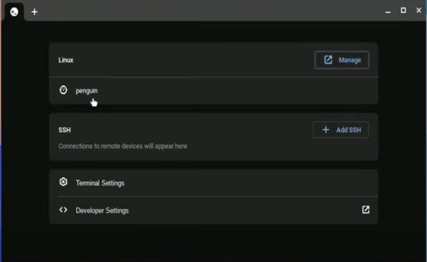
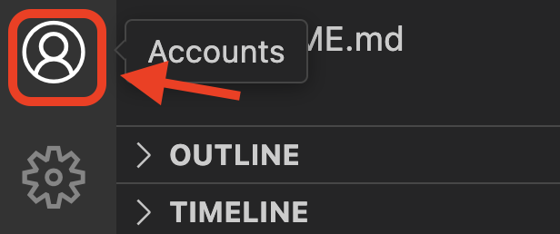

# Chromebook Setup

This guide follows the blog post here: https://code.visualstudio.com/blogs/2020/12/03/chromebook-get-started

A video that shows this clearly is here: https://www.youtube.com/watch?v=zx767PNqpBA

## Activating Development Mode

1. Go to Settings -> Advanced -> Linux -> Setup Linux.
2. Specify how much space you will devote to linux. Don't use all your space for linux. Between 2 GB and 10 GB should be enough
3. When finished, terminal should open. You can also get to terminal through the Terminal App, then clicking on "Penguin" after it opens.

## Opening the Terminal

To open the terminal...

1. Go to Apps -> Linux apps -> Terminal
2. This will open the "Settings" of the Terminal app. Under where it says "Linux", there should be a line that says "Penguin". Clicking on "Penguin" will open the terminal.

## Installing VSCode

### Installing Gnome Keyring (optional)

First install Gnome Keyring

    sudo apt-get update
    sudo apt-get install -y gnome-keyring

If you don't have success installing Gnome Keyring, you can still use VSCode, but it will be slightly less secure when you log into GitHub.

### Downloading and installing VSCode

You should now just download and install VSCode from the VSCode website. It is about a 100MB download.

Double click on the downloaded file install it.

### Troubleshooting

There are some errors that could occur. One is if you download the wrong installer for your CPU. Most Chromebooks are either arm64 or amd64. You can find out which you have with this command.

In your terminal, find out if you have what your chip type is.

    dpkg --print-architecture

Then download the .deb installer for the type of chip you have. If you have an amd64 chip, or an Intel chip, you will need x86. If you have an arm64 chip, you will need arm64.

    amd64 -> x86
    arm32 -> arm32
    arm64 -> arm64

*If you've allocated all your available space to the linux partition, you might not have space for the download. So be sure you didn't use up all the space during the Linux installation stage.

## Post install

You should get a GitHub account and log in to GitHub with VSCode in order to be able to clone and sync your repositories. To login click on the accounts icon near the bottom left of the screen.

## Setup git user.name and user.email

You will also need to set the user.email and user.name to be able to commit. This video shows you how from a terminal: https://www.youtube.com/watch?v=hklyjZGGvFw

These are the commands you will need:

    git config --global user.name "My Name"
    git config --global user.email "myemail@gmail.com"

